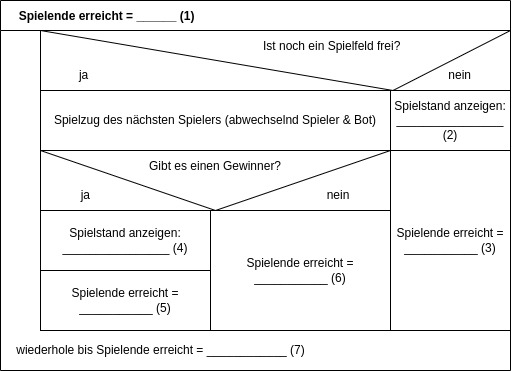
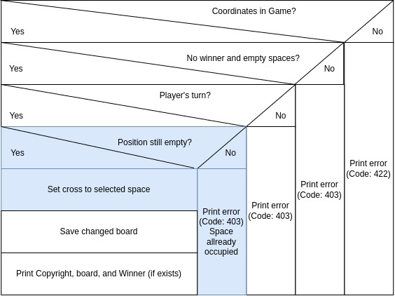

# Apprenticeship Challenge for future Computer Science Expert Subject Area: Software Development
This Challenge needs to be solved, if you want to snatch yourself an apprenticeship at [MÜNSMEDIA GmbH](https://muensmedia.de) as an Computer Science Expert Subject Area: Software Development. 👾 🤖 😎

## Tic-Tac-Toe
[Tic-Tac-Toe](https://de.wikipedia.org/wiki/Tic-Tac-Toe), noughts and crosses, or Xs and Os is a paper-and-pencil game for two players, that you're probably already familiar with.

## Gameplay / How it works
The game board consists of 9 empty spaces, aligned in a three-by-three grid.
Players alternately place the marks (:x:) and (:o:) in one of the empty spaces.

The player who succeeds in placing three of their marks in a horizontal, vertical, or diagonal row is the winner.
When no winner has been decided after all 9 spaces have been filled, the game ends in a draw.

### Example: Player X has won

### Exapmle: Draw

# Your Tasks

## 1.) Complete this Struktogramm

A Nassi-Shneiderman-Diagram or **Struktogramm** is a Diagram to show Program drafts as a Method for structural Programing.

A Struktogramm contains the following structural blocks, that are nested inside or combined with each other:

### Process

Every Process (or Chain of Commands), a Program should do, are written inside a rectangle Block.

### If-Case

If the Condition is met (true), Instruction 1 will run.

If the Condition isn't met (false), Instruction 2 will run. Instruction Blocks can also have multiple Instructions.

### Loop with exit condition (While-Loop)

It needs at least one loop, because the Repeat condition is checked **after** one loop. If this is true, the loop continues.

### Complete Struktogram for Tic-Tac-Toe Game

We started creating a Struktogram for the Tic-Tac-Toe Game, but your future trainer Malte isn't sure about the contents from the parts `(1), (2), (3), (4), (5), (6), (7)`.

*Solve this Task and put your Solution into your E-Mail, that you will send to us.*

## 2.) Getting ready to code
Now that you know how Tic-Tac-Toe works, we want to code it.
Dont worry. No matter if you dont have eny programming experience or just a bit, we will get there together 😉
We want to see and work together on Your sourcecode. To freely share sourcecode, we are using the platform GitHub.

### Please do the following steps
- [ ] You [already own a Github-Account](https://github.com/login)  **or** you [create yourself a free GitHub-Account](https://github.com/join)
- [ ] After signing in at GitHub.com:
- [ ] Copy our sourcecode to your GitHub-Account. Just [folgenden Link klicken](https://github.com/muensmedia/testaufgabe/generate).
  - **Please set the visibility of the new repository - as default - to 'Public'.**
- [ ] Now scroll down the newly created GitHub repository until you see these instructions.
- [ ] You continue from this point in the repository you have just created.
- [ ] [Open Gitpod](https://gitpod.io/workspaces)
- [ ] Click `Continue with GitHub`, choose `Authorize gitpod-io` and login with your GitHub-credentials.
- [ ] Make sure you are on https://gitpod.io/workspaces.
- [ ] By clicking `New Workspace` you create a new programming environment.
- [ ] In the opening dialog, select the address of your newly created repository.
- The GitPod Workspace should open itself.
- [ ] **Choose `Don't wait for prebuild`**
- Gitpod opens, *this can take some minutes 😳. Please be patient.*
- [ ] Open **in the meantime** https://gitpod.io/integrations
- [ ] In the row `GitHub github.com` click the `three dots` followed by `Edit Permissions`
- [ ] Additionally select `public_repo` and `repo` and save with `Update permissions`.
- [ ] Confirm your changes with `Authorize gitpod-io` and your password if applicable
- [ ] Now open these instructions there. To do this, right-click on the file `REDAME.md` and then on `Open Preview`.
- [ ] Continue with the instructions in your Gitpod programming environment.

## 3.) Change Copyright
Your Tic-Tac-Toe Webapp consists of a Frontend and Backend Part.  
As Frontend, we use a Tool called `Swagger`, so we can try out API's with a graphical Interface.
Swagger is already open, as you open GitPod's Web-IDE.
As Backend, we use a [PHP-App](https://www.php.net/manual/en/), based on the Framework [Laravel](https://laravel.com/docs/9.x).  

We have prepared a function, that displays this Game's Copyright. ©️

**Try this API-Method for display the Game's Copyright:**
- [ ] In Swagger, click on `/copyright`.
- [ ] Click on the Button `Try it out`.
- [ ] Send this Request by clicking on `Execute`.
- You can see the answer with the current Copyright at `Response body`.

✍🏼 **Change Copyright:**  
- [ ] Open File [app/app/App/Http/Controllers/CopyrightController.php](app/app/App/Http/Controllers/CopyrightController.php) in Gitpod.
- [ ] At Line `18` the Copyright is saved as a string.
- [ ] Use the ASCII Generator linked in `CopyrightController.php` to create your personal Copyright.
- [ ] Replace our Copyright `By MÜNSMEDIA GmbH` by your own Copyright.
- [ ] Try your new Copyright with Swagger!
- [ ] You need to save your changes, also named - **commit** (next section).

#### ✅ Create Commit:
  - On the left Side, click on Tab `Source Control` or you can press the keys <kbd>Strg</kbd>+<kbd>Shift</kbd>+<kbd>G</kbd> together.
  - Above, you can type a message, to describe your changes as detailed and meaningful as possible. **Please write your message in English, even if you are a native german speaker**.
  - Save your message with <kbd>Strg</kbd><kbd>⏎</kbd>
  - At the next Dialog, click on `Yes`, to add all your changes to your Commit.
  - **Click on the Button `Sync changes`**, to upload your changes to GitHub. Confirm with `OK`.
  - 🎉 You have done your first Git-Commit! 🎊

## 4.) writing the /play method
You can't play against the bot programmed by the MÜNSMEDIA team yet.
It is still missing die logic that should happen when the `/play`-API-Route gets called.

### Structogram for a turn
Here is the structogram for one of your turns with the `play()` method.

**To-do:**
- [ ] Take your time to look at the structogram for one of your turns!
  - We have highlighted the parts that you still need to implement in the structogram.
- [ ] In file [app/app/App/Http/Controllers/GameController.php](app/app/App/Http/Controllers/GameController.php) the `play()` methode on line 144 still needs some logic.
  - Please complete the missing logic. We left some comments in the source code to help you get started.
- [ ] Now test it in Swagger. The function there is also called `/play`.
- [ ] **❌ To reset the scoreboard, you can use the `DELETE /board` methode in Swagger**
- [ ] ✅ Create a Commit (see above `create Commit`)
- [ ] 🔁 Click the button `Sync changes` to upload your changes to GitHub.

## 5.) 🤖 Turn - /play-bot
We already write a 🤖 (Bot) for you, so you can play against him.  
Open Swagger and alternate between the `/play` and `/play-bot`-API-Route (First Turn is yours).

## 6.) NO CHEATING! - <kbd>↑</kbd><kbd>↑</kbd><kbd>↓</kbd><kbd>↓</kbd><kbd>←</kbd><kbd>→</kbd><kbd>←</kbd><kbd>→</kbd><kbd>B</kbd><kbd>A</kbd>
Currently, you or the bot can play multiple turns in a row, although you are supposed to take turns.
Of course, it's no fun like that 😞!

**To-do:**
- [ ] In file [app/app/App/Http/Controllers/GameController.php](app/app/App/Http/Controllers/GameController.php) the `isAllowedToPlay()` methode on line 144 still needs some logic.
  - Please complete the missing logic. We left some comments in the source code to help you get started.
- [ ] thoroughly test your changes in Swagger.
- [ ] ✅ Create a Commit (see above `create Commit`)
- [ ] 🔁 Click the button `Sync changes` to upload your changes to GitHub.

## 7.) Who's the Winner? 🏆 
Currently, the game is unable to display a winner.  
Now it's your task, to do this.

**To-do:**
- [ ] Currently, the Method `whoHasWon()` in [app/app/App/Http/Controllers/GameController.php](app/app/App/Http/Controllers/GameController.php) at Line 104 has no Game logic.
  - Add the missing logic. We created some Hint's, to how you can achieve this, as Comments in the Code.
- [ ] Test your changes with Swagger as detailed as possible.
- [ ] ✅ Create a Commit (see above `Create Commit`)
- [ ] 🔁 Click on `Sync changes`, to upload your changes to GitHub.

## Additional tasks
You had fun by solving this tiny tasks above and you want more? **Ok, no Problem 😈!**

### 8.) Make Method someoneHasWon() prettier ✨
The Method `someoneHasWon()` at [app/app/App/Http/Controllers/GameController.php](app/app/App/Http/Controllers/GameController.php) is currently ugly.  
Can you simplify this, by using some loops?  
It can be useful, to look at **public-methods** from `$game`:
[app/app/Components/GameBoard/GameBoard.php](app/app/Components/GameBoard/GameBoard.php)

**To-do:**
- [ ] Make Method `someoneHasWon()` prettier
- [ ] Test your changes with Swagger as detailed as possible.
- [ ] ✅ Create a Commit (see above `Create Commit`)
- [ ] 🔁 Click on `Sync changes`, to upload your changes to GitHub.

### 9.) 4x4 Tic-Tac-Toe 😈
Think about, what you need to change, so we can play a 4x4 Tic-Tac-Toe.
Look also closer at the class [app/app/Components/GameBoard/GameBoard.php](app/app/Components/GameBoard/GameBoard.php).

**To-do:**
- [ ] Try to make a 4x4 Tic-Tac-Toe
  - You will need your changes from Task 7.)
- [ ] Test your changes with Swagger as detailed as possible.
- [ ] ✅ Create a Commit (see above `Create Commit`)
- [ ] 🔁 Click on `Sync changes`, to upload your changes to GitHub.

# ➡ And what's next?
Once you are done, sent your Solution for Task 1 and your GitHub-Repository Link via E-Mail back to us.  
We analyse your Solution and if you are one of the 5 best applicants, we will invite you to a personal meeting, so we can get to know us better.  
See you soon!
